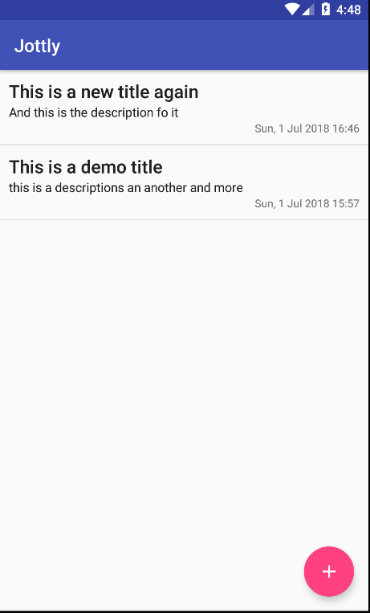

# Jottly

This is an Android app for the ALC 3.0 challenge

## Getting Started

Install the app on the device either directly using the browser or use the `adb` command line.

### Prerequisites

There are no pre-requisites.

### Installing

To install the app on the device, copy the url of the apk and paste it on the browser on your device. Android will prompt you to install the app once the download is complete.

Make sure to allow installing from unknown sources.

## Built With

* [Android Studio](https://developer.android.com/studio/) - The IDE
* [Java 8](http://www.oracle.com/technetwork/java/javase/overview/java8-2100321.html) - The Language
* [MVVM Pattern](https://en.wikipedia.org/wiki/Model%E2%80%93view%E2%80%93viewmodel) - The pattern
* [Android Architecture Components](https://developer.android.com/topic/libraries/architecture/) - Libraries
* [ROME](https://rometools.github.io/rome/) - Used to generate RSS Feeds

## Authors

* **Joseph Kandi** - *Initial work* - [josephkandi](https://github.com/josephkandi)

## License

This project is licensed under the MIT License - see the [LICENSE.md](LICENSE.md) file for details

## Acknowledgments

* ALC
* Udacity
* ALC 3.0 #android-dev channel users

